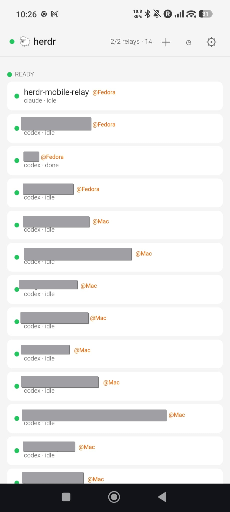
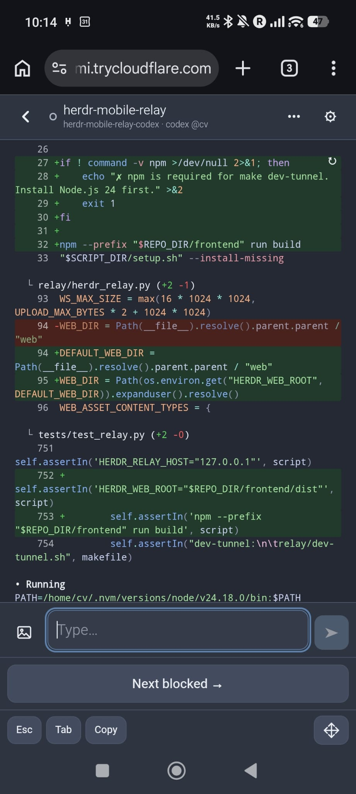
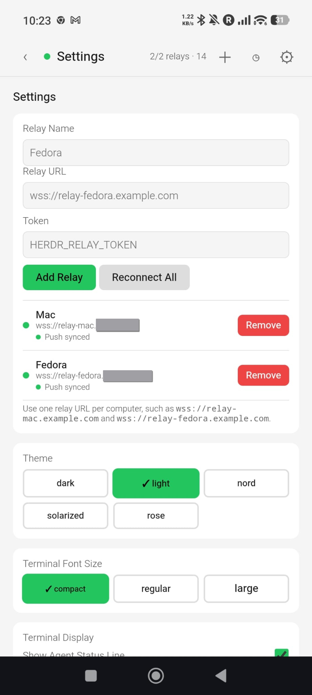

# Herdr Mobile Relay

[](https://github.com/0cv/herdr-mobile-relay/actions/workflows/check.yml)

Approve [Herdr](https://herdr.dev) agents from your phone across multiple computers.

Herdr Mobile Relay runs a small local relay on each computer, exposes each relay through its own Cloudflare Tunnel hostname, and lets one static web app connect to all of them. The phone UI merges agents from every configured relay, so you can approve or inspect agents running on a Mac, a Fedora workstation, or any other supported machine without making those computers connect to each other.

> [!IMPORTANT]
> Herdr Mobile Relay currently supports Linux and macOS. Native Windows is not supported. It may work inside WSL2 because that provides a Linux environment, but WSL2 has not been tested and is not currently an officially supported setup.

## [Quick Start: One Command](QUICKSTART.md)

New here? Paste this into a terminal on a Linux or macOS computer:

```bash
git clone https://github.com/0cv/herdr-mobile-relay.git && cd herdr-mobile-relay && make quick-start
```

That command prepares the local configuration, offers to install missing Herdr, `uv`, and `cloudflared` tools for your user account, starts the relay, serves the phone app, and opens a free temporary Cloudflare tunnel. **A Cloudflare account, domain, Node.js, Python installation, and separate web deployment are not required for this first trial.**

When it is ready, the terminal prints a **QR code** and the matching private **Phone setup** link. Scan the QR code with your phone camera, or open the exact link on your phone; either way the app loads and adds the relay automatically. Keep the terminal open while using the quick tunnel, and press Ctrl-C when finished.

> [!CAUTION]
> The setup link — and therefore the QR code — contains the relay token in its URL fragment. The fragment is not sent to the web server and the app removes it after importing, but you should still avoid sharing the original link or a screenshot of the QR code.

See the **[beginner-friendly QUICKSTART](QUICKSTART.md)** for screenshots-level steps, what the command installs, and troubleshooting. Once the trial works, move to a [stable hostname and background service](#stable-hostnames) for everyday use.

## Screenshots

| Agents                                                                                                             | Terminal                                                                                                                 |
| ------------------------------------------------------------------------------------------------------------------ | ------------------------------------------------------------------------------------------------------------------------ |
|  |  |

| Start Agent                                                                                                                                                      | Activity                                                                                                                    |
| ---------------------------------------------------------------------------------------------------------------------------------------------------------------- | --------------------------------------------------------------------------------------------------------------------------- |
|  |  |

| Settings                                                                                                        | Notifications                                                                                                 |
| --------------------------------------------------------------------------------------------------------------- | ------------------------------------------------------------------------------------------------------------- |
|  |  |

## What This Fork Adds

Forked from [dcolinmorgan/herdr-remote](https://github.com/dcolinmorgan/herdr-remote), which established the core idea: control Herdr approval prompts from another device. This fork turns that idea into an installable mobile web app for multiple machines, with no central broker and no machine-to-machine trust.

- **Multi-computer phone UI:** one static web app connects to multiple independent relays and merges Mac, Fedora, or other hosts into one agent list.
- **Per-machine isolation:** each computer runs only its own local relay and `herdr` CLI calls; relays do not SSH into each other or share state.
- **PWA notifications:** installed phones can receive Web Push notifications when an agent blocks, including Approve once and Deny actions that route through the configured relay and device unlock.
- **Mobile terminal composer:** terminal view has a compact phone-first composer, quick terminal keys, inline approval actions, themes, font sizing, and a jump-to-bottom affordance.
- **Real approval handling:** blocked cards parse prompt text and approval options, then map visible choices back to the correct Herdr key actions for Codex and Claude Code.
- **Confirmed controls and activity:** command acknowledgements report failures explicitly, approvals wait for an observed state change, and a bounded per-relay activity history is merged on the phone.
- **Activity-aware home ordering:** agents most recently changed on their computer appear first within each status section, including activity initiated outside the phone app.
- **Remote agent management:** start automatically detected installed agents, then rename, clear, or stop them from the phone.
- **Screenshot/photo upload:** attach an image from the phone, store it on the target computer, and insert the local path into the agent prompt.
- **Optional device unlock:** require the phone's platform authenticator before reconnecting relays after open, reload, or resume.
- **Service installers:** macOS launchd and Linux/Fedora user systemd installers set up the relay, tunnel, token, and cleanup of older service names.
- **One-command trial:** the relay can serve the phone app itself, install missing user-level prerequisites with confirmation, and provide an auto-configuring TryCloudflare link.
- **Security hardening:** token generation, loopback binding by default, Origin checks for browser clients, constant-time token comparison, and safer behavior for public tunnels.

## Marketplace Listing

**Name:** Herdr Mobile Relay

**Repository slug:** `herdr-mobile-relay`

**Plugin ID:** `herdr-mobile-relay.events`

**Short description:** Approve Herdr agents from your phone across multiple computers.

**Long description:** Run one local relay per computer, expose each relay through Cloudflare Tunnel, and manage all agents from one installable mobile web app. Herdr Mobile Relay keeps machines independent: there is no SSH fan-out, central broker, Telegram bot, or native mobile app to install. It adds multi-relay agent merging, actionable Web Push notifications, confirmed terminal and approval controls, remote agent lifecycle management, merged activity history, screenshot/photo upload, optional device unlock, and service installers for macOS and Linux.

**Tags:** mobile, relay, cloudflare, multi-machine, approvals

## What It Does

- Runs one local relay per computer.
- Polls only the local `herdr` CLI on that computer.
- Exposes the relay through a `wss://` URL, usually via Cloudflare Tunnel.
- Lets the static web app connect to multiple relays and merge their agent lists client-side.
- Uses relay labels from the web app, such as `Mac` or `Fedora`, as the visible host badges.
- Shows blocked prompts with inline approval buttons on the agent list and in the terminal view.
- Sends Web Push notifications for blocked agents to installed phones, even when the app is closed or suspended.
- Routes notification taps and Approve once/Deny actions back to the matching relay and pane when the app can resolve it.
- Confirms remote commands and records blocked, resolved, approval, prompt, upload, and lifecycle activity locally on each relay.
- Starts automatically detected installed agents and supports rename, clear, and stop controls.
- Uploads screenshots and photos from the phone to the connected relay's local filesystem.
- Provides a compact mobile terminal UI with send, attach, terminal keys, themes, and font-size controls.
- Can require fingerprint, face unlock, or passcode verification before reconnecting relays.
- Supports an optional local Herdr plugin hook for faster blocked-agent updates.

## What It Does Not Do

- It does not connect your computers to each other.
- It does not use SSH remotes or SSH fan-out.
- It does not run a central hosted broker.
- It does not require Telegram, a native iOS app, or a native macOS menu bar app.
- It does not currently run natively on Windows. WSL2 may work but remains untested and unsupported.

## Components

- **Relay:** Python WebSocket service that also serves the phone app and an HTTP health response on port `8375`.
- **Web app:** static mobile UI in `web/`; stores relay configs in browser local storage.
- **Cloudflare Tunnel:** optional but recommended public access layer for each relay.
- **Background services:** launchd on macOS and user systemd on Linux/Fedora start the relay and `cloudflared`.
- **Herdr plugin hook:** optional local event push from `herdr` into the local relay over UDP.

## Requirements

The one-command quick start needs only:

- Linux or macOS; native Windows is not supported, and WSL2 remains untested
- Git, Make, and `curl`

With your confirmation, `make quick-start` installs missing [Herdr](https://herdr.dev/docs/install/), [uv](https://docs.astral.sh/uv/getting-started/installation/), and [`cloudflared`](https://developers.cloudflare.com/tunnel/downloads/) tools for your user account. `uv` also supplies Python when necessary.

Optional later requirements:

- A Cloudflare account and domain for a permanent named tunnel
- Node.js/npm only for deploying a separate Cloudflare Pages copy or running the frontend checks

## Web App

The web app is static and lives in `web/`. The one-command quick start serves it directly from the relay, so beginners do not need to deploy it separately.

For an independent, always-available app origin—especially useful with multiple computers—you can still deploy `web/` anywhere that hosts static files over HTTPS. With Cloudflare Pages direct upload:

```bash
# edit WEB_PROJECT in .env first if needed
make web-deploy
```

### Install on Your Phone

For the first trial, simply scan the printed QR code or open the printed Phone setup link. Quick-tunnel hostnames change, so wait until you have a stable hostname or independently hosted app before treating the installation as permanent. Install the HTTPS app URL, not a `wss://` relay URL; the installed app keeps relay settings in browser local storage.

On iPhone or iPad:

1. Open the deployed Herdr Mobile Relay web app in Safari.
2. Tap Share.
3. Tap Add to Home Screen.
4. Tap Add.

On Android:

1. Open the deployed Herdr Mobile Relay web app in Chrome.
2. Tap the install prompt, or open the three-dot menu.
3. Tap Install app or Add to Home screen.
4. Confirm the install.

The app includes a web manifest and Apple touch icon, so it installs with the Herdr Relay icon.

The Phone setup link adds the first relay automatically. To add another relay manually, use Settings:

- **Relay Name:** display label such as `Mac` or `Fedora`
- **Relay URL:** `wss://...`
- **Token:** value of `HERDR_RELAY_TOKEN`

Then tap **Enable Notifications** in Settings. The relay generates Web Push VAPID keys in `relay/push/` and stores this device's push subscription there, so installed PWAs can be notified even when the app is closed or suspended.

For multiple relays, the app creates one scoped service-worker push subscription per relay. Each relay keeps its standard VAPID keypair and subscriptions privately under `relay/push/`; no push configuration is required.

In the terminal view, tap the image icon to attach a screenshot or photo. The web app uploads images up to 10 MB to `~/.cache/herdr-mobile-relay/uploads` on that computer and inserts the local file path into the prompt.

Claude Code's alternate-screen interface exposes only its current visible rows through Herdr. While the relay is running, it therefore builds a stable, bounded 500-line in-memory history from advancing Claude snapshots. Known older viewports are ignored, so scrolling the laptop while Claude is idle does not rewrite the phone history. The relay still cannot recover text discarded before it started, and the accumulated history resets with the relay.

Use **＋** in the app header to start an agent on a connected computer. The relay exposes detected `codex`, `claude`, and `opencode` executables as safe launch profiles. Select a working directory reported by that relay; the suggested name updates to `<directory>-<agent>`. The optional initial task is sent as the agent's first literal prompt after Herdr creates it and is never interpreted by a shell. Each launched agent is moved into its own named tab so it cannot inherit another agent's tab label. Use **•••** from a terminal to rename, clear, or stop that agent. Clear starts a fresh replacement with the same detected profile and working directory, moves it to a dedicated tab, and then closes the old pane.

Use **◷** to view and search the merged activity history from all connected relays. Each relay keeps the latest 500 entries in `~/.cache/herdr-mobile-relay/activity.jsonl`. Prompt activity stores only a short preview, not full terminal output.

Within each home-page status section, agents are ordered by the most recent change observed by their relay. Herdr does not currently expose a historical activity timestamp, so the relay infers this from status changes, terminal-output growth, metadata changes, phone actions, and agent events while it is running. Ordering falls back to the existing host/name order after a relay restart until new activity is observed.

The relay automatically exposes installed Codex, Claude Code, and OpenCode executables in the Start Agent form. Its working-directory browser starts at the relay user's home directory and retrieves only the current folder's immediate non-hidden subdirectories as you navigate. It does not recursively scan or preload the filesystem. There is no profile configuration, and the browser cannot submit an executable or arbitrary shell command. Navigation and agent launches stay inside the current user's home directory.

## Stable Hostnames

For day-to-day use, create one named Cloudflare Tunnel and one DNS hostname per computer:

```bash
# On the Mac
cloudflared tunnel login
cloudflared tunnel create herdr-mobile-relay-mac
cloudflared tunnel route dns herdr-mobile-relay-mac relay-mac.yourdomain.com

# On Fedora
cloudflared tunnel create herdr-mobile-relay-fedora
cloudflared tunnel route dns herdr-mobile-relay-fedora relay-fedora.yourdomain.com
```

Create `~/.cloudflared/config-herdr-mobile-relay.yml` on each computer. Example for the Mac:

```yaml
tunnel: herdr-mobile-relay-mac
credentials-file: /Users/you/.cloudflared/<TUNNEL_ID>.json

ingress:
  - hostname: relay-mac.yourdomain.com
    service: http://localhost:8375
  - service: http_status:404
```

For Fedora:

```yaml
tunnel: herdr-mobile-relay-fedora
credentials-file: /home/you/.cloudflared/<TUNNEL_ID>.json

ingress:
  - hostname: relay-fedora.yourdomain.com
    service: http://localhost:8375
  - service: http_status:404
```

Then add each relay to the phone the same way as the quick start — print its setup link and QR code on that computer:

```bash
make setup-link
```

It reads the token from `relay/.env` and the hostname from the cloudflared config, so scanning the QR code (or opening the link) adds the relay to the app automatically. The relay and tunnel must be running. If the hostname cannot be detected, pass it explicitly with `make setup-link HOST=relay-mac.yourdomain.com`.

The setup link configures the app served at the relay's own hostname. If you installed the app from a separately hosted origin instead, add the relay in that app's Settings using the relay URLs:

```text
wss://relay-mac.yourdomain.com
wss://relay-fedora.yourdomain.com
```

Do not run multiple computers as replicas of the same Cloudflare Tunnel if they serve different local relays. Cloudflare may send a WebSocket to any connector for that tunnel.

## Background Services

The background service starts both the relay and `cloudflared`. The generic commands detect macOS or Linux automatically:

```bash
make service-install
make service-status
make service-logs
make service-uninstall
```

The older `make macos-service-*` and `make linux-service-*` targets remain available for explicit platform-specific use.

Normal installs need only two values in `relay/.env`. `make setup` generates the token, and the stable service installer adds the tunnel path:

```env
HERDR_RELAY_TOKEN=<shared-secret>
CLOUDFLARED_CONFIG=$HOME/.cloudflared/config-herdr-mobile-relay.yml
```

Read the token for the web app:

```bash
sed -n 's/^HERDR_RELAY_TOKEN=//p' relay/.env
```

New installs use `com.herdr-mobile-relay.service` on macOS and `herdr-mobile-relay.service` on Linux/Fedora. The installers remove the earlier `herdr-remote` service labels when they run. Existing ignored `relay/.env` files may still point at `config-herdr-remote.yml`; that is fine as long as the file exists, or you can update `CLOUDFLARED_CONFIG` to the new `config-herdr-mobile-relay.yml` path.

## Token Auth

Enable relay auth with:

```bash
export HERDR_RELAY_TOKEN="$(openssl rand -hex 16)"
make relay-run
```

Use the same `HERDR_RELAY_TOKEN` on multiple relays if you want one shared phone-side secret.

If a token leaks — for example a shared screenshot of a setup QR code — rotate it:

```bash
make rotate-token
```

This writes a new token to `relay/.env`, restarts the background service when one is installed, and prints a fresh setup link and QR code to re-add the relay on each phone. Configurations using the old token stop working as soon as the relay restarts.

## Herdr Plugin Hook

The relay polls local `herdr` every few seconds. For faster blocked-agent updates, link the local plugin hook on each computer:

```bash
make relay-plugin
```

The plugin sends local agent-status events to the local relay over UDP on `127.0.0.1:8376`. It does not expose another network service and does not connect to other computers.

## Security Model

- The relay-served phone app is public static content; status and control WebSockets still require the relay token.
- Quick-start setup links carry the token only in the URL fragment, which is not included in HTTP requests, and the app removes it from the address bar after import.
- Relay access is protected with `HERDR_RELAY_TOKEN` for quick-start and service installs.
- Cloudflare Tunnel provides the public TLS endpoint; the relay itself listens locally on `127.0.0.1:8375` by default.
- Set `HERDR_RELAY_HOST` only if you intentionally need a non-loopback bind address. The relay refuses a non-loopback bind without `HERDR_RELAY_TOKEN`.
- Tokenless browser connections are rejected unless their `Origin` is listed in `HERDR_ALLOWED_ORIGINS` as a comma-separated list, such as `https://your-pages-site.pages.dev`.
- The web app stores relay URLs and tokens in browser local storage on the device where you configure it.
- Web Push VAPID private keys and push subscriptions are local runtime state in `relay/push/`; keep that directory private and do not commit it.
- A connected web client can send text and key input to Herdr panes exposed by that relay. Treat relay URLs and tokens as sensitive.
- Notification action payloads contain only relay/pane routing metadata. The PWA reconnects with its locally stored relay credential and performs device verification when enabled before sending the action.
- Agent launch requests select only from supported executables automatically found by the relay; the browser cannot submit an executable or shell command.
- The relay executes only fixed local `herdr pane ...` and supported `herdr agent ...` operations; it does not shell into other machines.

## Health and Versions

`GET /health` keeps the original plain-text `ok` response for existing uptime checks. `GET /healthz` returns `{"status": "ok", "version": "<git-hash>[-dirty]", "protocol": <n>}` without authentication for detailed monitoring. The relay also prints its version at startup and reports it to the app, which shows it per relay in Settings. When a relay and the app speak different protocol versions, Settings shows an update warning and blocks incompatible control commands.

Uploaded images in `~/.cache/herdr-mobile-relay/uploads` are pruned automatically after 7 days.

## License

Herdr Mobile Relay is licensed under the [GNU Affero General Public License v3.0 or later](LICENSE).
